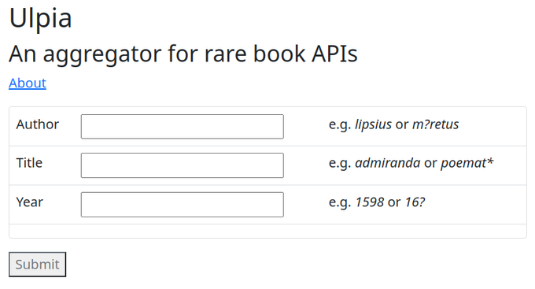
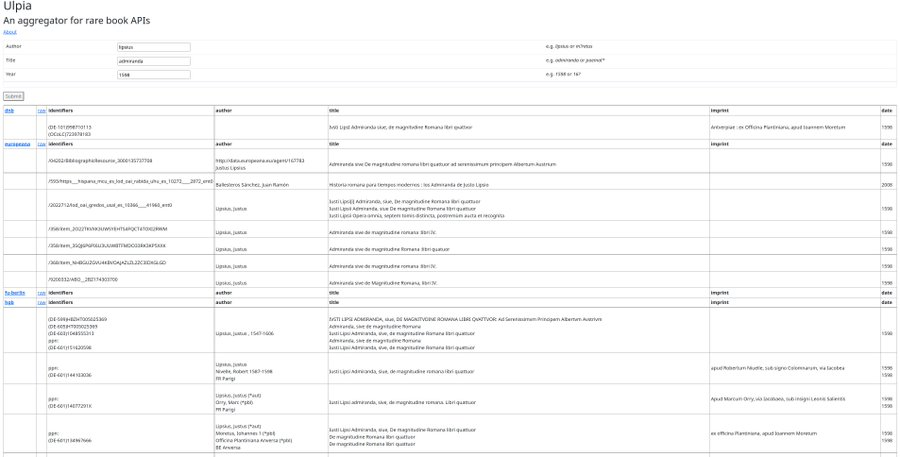
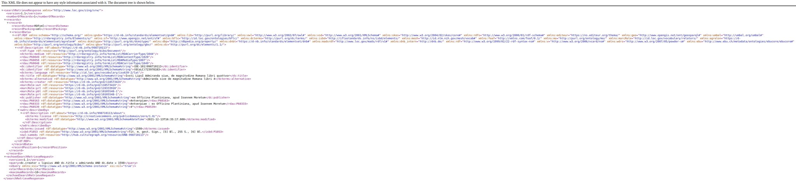

# Ulpia

## What is Ulpia?

Ulpia is an aggregator. It scans multiple rare book databases and returns the most relevant results.

It is named after the [Ulpian library](https://en.wikipedia.org/wiki/Ulpian_Library), a Roman library founded by the Emperor Trajan in AD 114 and  the major library in the Western World upon the destruction of the Library of Alexandria in the 3rd century.

## How can I use Ulpia?

Ulpia is an aggregator for rare book APIs. With a single click you can search the combined datasets of CERL Heritage of the Printed Book, the Bibliothèque nationale de France, Google Books, and many more (see below). You can combine search terms (author, title, year of publication) and use wildcards.

The application returns concise bibliographic data for each match (author, title, imprint, year of publication), but also a link to the original full API response (XML or JSON).

In this way, Ulpia is a discovery tool, meant to help identify or locate rare books, and start the bibliographic journey, rather than get detailed metadata (for which the individual databases are better suited).

## How is Ulpia made?

Ulpia is a serverless API aggregator with a "back-end" in Go (compiled to WebAssembly) and a front-end in JavaScript and Bootstrap CSS.

### Serverless

An application that sends out requests to different APIs is typically made in a server-client environment. As I didn't want to set up a separate server for this, I made the application *serverless* by performing the web requests in the browser (using a CORS proxy). So instead of having to maintain a server environment, I can host just this project on GitHub Pages as a static website.

### Go / WebAssembly

Thanks to the integration of Go and WebAssembly, I could use Go for the "back-end" of Ulpia, most notably parsing the XML or JSON responses from the different APIs, and presenting the results in HTML templates.

### JavaScript

The actual request is done in JavaScript, making full use of the language's asynchronicity and speed.

## Data

Ulpia currently queries APIs (especially SRU servers) of the following datasets:

- CERL Heritage of the Printed Book
- Bibliothèque national de France
- Deutsche Nationalbibliothek
- Unicat -- The Union Catalogue of Belgian Libraries
- Trove
- Google Books
- Europeana
- OpenLibrary
- Freie Universität Berlin

If you know of any other datasets that could be used for this project (provided they do not block CORS proxies), please let me know!
